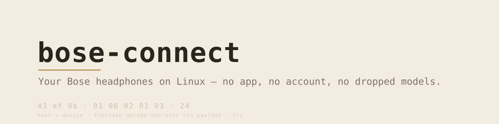

Implements the [bose-rfcomm](https://github.com/kaledcorona/bose-rfcomm)
protocol, mapped from four devices across two generations: the QuietComfort 35,
Sport Earbuds, QC Earbuds II, and QC Ultra Headphones.

## Why

Bose ships no Linux app, and drops older models from the one it does ship. The
three existing tools each hardcode a table of device ids and a fixed RFCOMM
channel, so they are wrong about any model their author did not own.

This asks the device instead. Same code path for a 2016 QC35 and a 2023 Ultra,
with the differences handled rather than assumed.

## Install

    cargo install --path .                     # into ~/.cargo/bin
    cargo install --path . --features bluez    # + the `devices` subcommand

Or build in place with `cargo build --release` and run
`target/release/bose-connect`. Either way `bluez` is needed at runtime, and the
headphones paired first with `bluetoothctl`. The `bluez` feature adds
`bose-connect devices` and the D-Bus stack it needs, so it is off by default.

## Examples

Find a paired device, or use its address straight:

    $ bose-connect devices
    AA:BB:CC:00:00:01  009e:4066  Bose QC Ultra Headphones     connected

    $ bose-connect AA:BB:CC:00:00:01 info
    channel   1
    id        0x4066 index 1
    model     Bose QC Ultra Headphones
    version   1.6.7+g6ebabd2
    serial    REDACTED-SERIAL
    supports  anc:graded eq:true immersive:true modes:true
    functions 00 01 02 04 05 07 1f
    immersive off

One command, two models, different answers — read from the opcode each model
uses, with the accepted levels from the device's own bitmask:

    $ bose-connect $ULTRA anc
    cancelling 10 of 10  (awareness 0)
    $ bose-connect $QC35 anc
    high  (accepts off, high, low)
    $ bose-connect $QC35 anc low

The equaliser's ranges come from the device, so a client draws the control
without knowing the model:

    $ bose-connect $ULTRA eq
    band 0    0  [-10..10]
    band 1    0  [-10..10]
    band 2    0  [-10..10]
    $ bose-connect $ULTRA eq 0 6               # band 0 to +6

    $ bose-connect $QC35 battery
    cell 0  70%
    $ bose-connect $QC35 volume 8
    $ bose-connect $QC35 auto-off never

List and switch modes, on the Ultra generation:

    $ bose-connect $ULTRA modes
    0  Quiet
    1  Aware
    2  Immersion
    3  Focus
    4  Home
    $ bose-connect $ULTRA mode 3               # switch to Focus

The Ultra has no cancellation dial: `01 05` refuses a write, so its cancellation
lives in a mode — edit a mode's level, or select one that already has the level
you want. Building and editing modes is a library call (`save_mode`); a
libadwaita front-end puts it behind a form.

The channel probe runs once, four seconds a channel, and the answer is cached
under `$XDG_CACHE_HOME/bose-connect/`; `--channel N` skips both. Asking for
something a model lacks says so without a round trip — the QC35's function `01`
enumerates and never mentions `07`:

    $ bose-connect $QC35 eq
    bose-connect: 01 07: this model does not have it

### Exploring

Three commands need no per-record code, so they reach what the catalog has not
named yet:

    $ bose-connect catalog             # every record this build knows
    $ bose-connect $MAC raw 1f 03      # read one address, decoded by nobody
    $ bose-connect $MAC scan           # which functions answer, 00-3f

Addresses are hex, as `catalog` prints them; quantities are decimal.

### Scripting

`json` prints identity and capabilities, so a status bar or tray applet needs no
bindings:

    $ bose-connect $MAC json
    {
      "channel": 1,
      "model": "Bose QC Ultra Headphones",
      "anc": "graded",
      "modes": true,
      "battery": [{"cell": 0, "percent": 80}]
    }

```python
import json, subprocess

def bose(mac, *args):
    out = subprocess.run(["bose-connect", mac, *args],
                         capture_output=True, text=True, check=True).stdout
    return json.loads(out) if args == ("json",) else out

info = bose(MAC, "json")
if info["battery"]:
    print(f"{info['battery'][0]['percent']}%")
```

## How to contribute

The vendor documents none of this, so the most useful contribution is a device
this project has not mapped. Bugs and patches are welcome too.

**Open an issue** to report a bug, ask for a control, or share what a device does
on the wire. For a protocol observation, include the model from `bose-connect
info` and the output of `bose-connect $MAC scan` with any `raw <fn> <op>` reads —
that is enough to place a new record.

**Send a pull request** by forking, branching off `main`, and keeping one topic
per PR. Run `cargo test` and `cargo clippy` first; both are clean on `main`. The
project follows [GitHub flow](https://docs.github.com/en/get-started/using-github/github-flow),
and commit subjects are imperative and specific — "Correct the operators", not
"fix stuff".

A protocol finding is usually one entry in `src/catalog.rs`. The [contributor
guide](https://github.com/kaledcorona/bose-connect/wiki/Contributing) covers the
record shape, the evidence that gates a write, and the fixtures that test it
without hardware.

## As a library

Two verbs carry everything — `get` and `set` — and a named accessor is one line
over them. `Transport` is a trait, so the protocol drives from recorded traffic
as readily as from a socket, which is how the tests cover both generations with
no device present.

The [library guide](https://github.com/kaledcorona/bose-connect/wiki/Library)
covers the eight layers, the fixtures, and the three-answer error model — a
request gets a value, a refusal, or silence, and the three are not the same.

## Tests

    cargo test        # 99, none need hardware

## Roadmap

See [`ROADMAP.md`](ROADMAP.md). Captures wanted are listed first; each is one
catalog entry away from a feature.

## Licence

MIT. The protocol itself is not covered — opcodes and byte layouts are facts.
